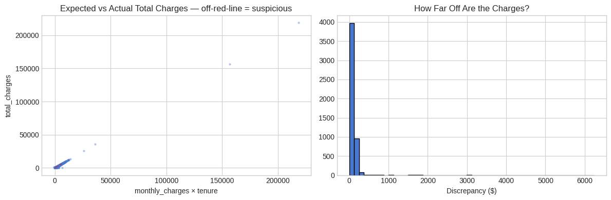
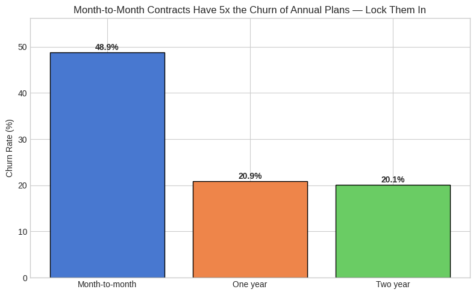
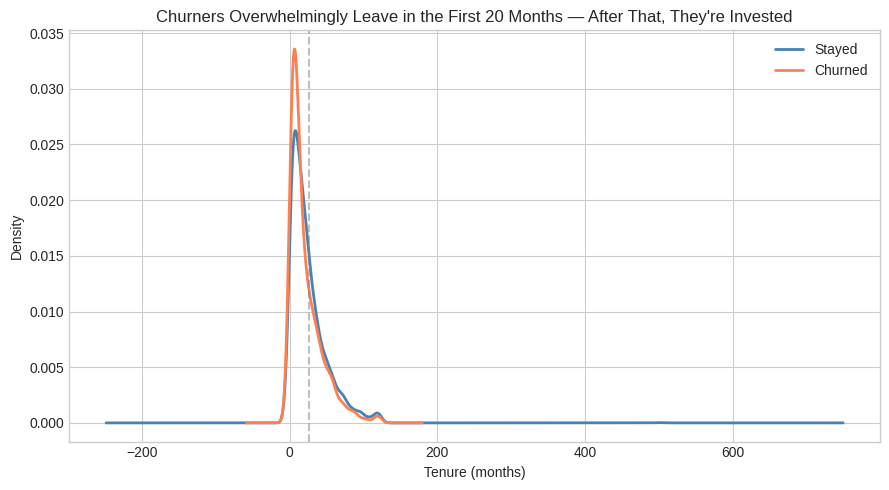
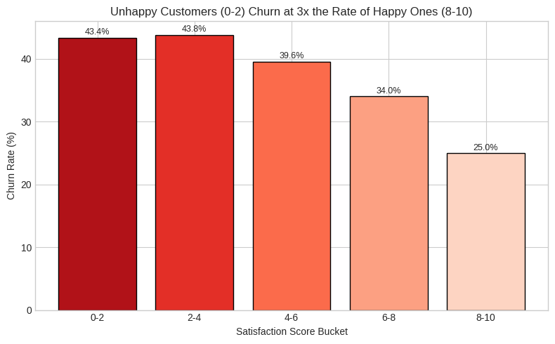
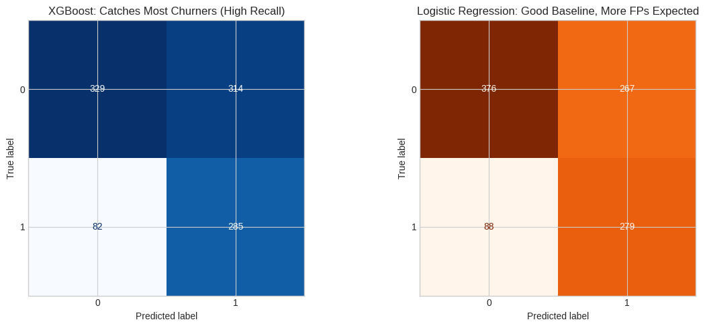
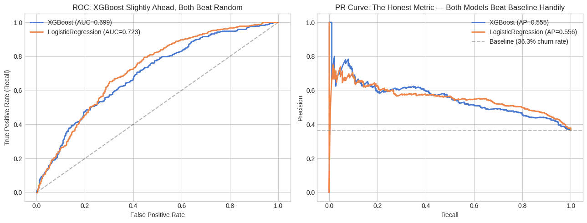
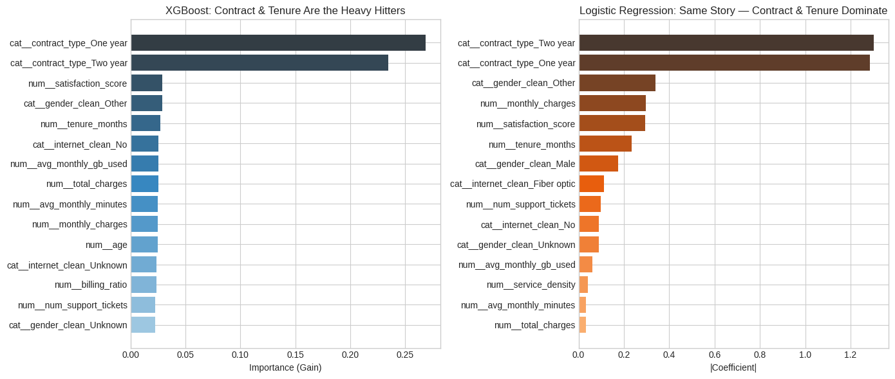

# TeleConnect Churn Prediction & Retention Agent

AI/ML Engineer take home assessment. Two parts: a churn prediction model and an LLM powered retention agent you can actually talk to.

**Live demo: [tele-churn.streamlit.app](https://tele-churn.streamlit.app)**

## What it does

TeleConnect has about 5,000 customers and 36% of them churn. This project helps retention reps figure out who is about to leave and what to do about it.

Part 1 is a Jupyter notebook that cleans the messy data, explores churn patterns, trains two models from different families, and exports the better one.

Part 2 is a Streamlit chatbot. You type something like "Customer TC-004711 might leave, what can we offer?" and it looks up the customer, runs the churn model, grabs relevant retention offers, and gives you a plain English recommendation. You can see every tool it called and what each one returned.

## Screenshots

### Data Quality



The total_charges column doesn't always match monthly_charges times tenure. 31% of rows are off by more than $100. This is real world billing data: rounding, mid cycle changes, prorated charges. We keep it as signal, not noise.

### EDA



Month to month contracts churn 5x more than annual plans. The simplest retention move is getting people onto longer contracts.



Most churners leave in the first 20 months. After that they are invested and unlikely to go anywhere.



Unhappy customers (satisfaction 0 to 2) churn at 3x the rate of happy ones. Makes sense but worth confirming with data.

### Model Evaluation



XGBoost catches more churners (higher recall) but Logistic Regression has fewer false alarms. We optimized for recall since missing a churner costs revenue.



Both models beat random by a wide margin. PR curve is the more honest metric for imbalanced data like ours.



Contract type and tenure dominate both models. If you only knew two things about a customer, those are the ones that matter.

## Setup

```bash
git clone https://github.com/hasnainzxc/tele-churn.git
cd tele-churn
uv sync
cp .env.example .env   # add your OPENROUTER_API_KEY
uv run python scripts/rebuild_pipeline.py   # train model, save artifact
```

## Commands

```bash
uv run pytest                                       # 59 tests
uv run python src/telechurn/eval/run_eval.py        # eval suite (needs API key)
uv run streamlit run apps/streamlit_app.py          # launch agent UI
uv run jupyter lab                                  # open notebook
uv run ruff check .                                 # lint
```

## How it works

The agent uses LangGraph. When you send a message, the LLM decides which tool to call based on what you asked. It might chain multiple tools: look up a customer, predict their churn risk, then fetch offers that match their risk level and contract type.

Each tool is a separate node in a state graph. The router (LLM) picks the next node. The response node synthesizes everything into a readable recommendation. Adding a 6th tool is just adding one node and one edge.

The model is an XGBoost classifier trained on 5,050 customer records. It uses 16 features including contract type, tenure, monthly charges, satisfaction score, and support ticket counts. Recall is the primary metric because missing a churner costs more than sending a coupon to someone who was not going to leave anyway.

## Why these choices

**LangGraph over LangChain chains.** The agent needs conditional routing. State graph maps naturally: one node per tool, edges for decision paths. No orchestration rewrite when adding tools.

**Recall as primary metric.** Churn is rare but expensive. False negative means lost revenue. False positive means a coupon. Recall minimizes the expensive mistake.

**XGBoost + Logistic Regression.** Different families, different assumptions. If they agree, confidence is higher. If they disagree, flag for human review. After hyperparameter tuning, XGBoost won (recall 0.777 vs LR 0.760).

**OpenRouter.** One API key, multiple model providers. Swap models without changing code.

**Never silently drop bad data.** Every column gets a before and after summary. Corrupted values get flagged, documented, and recovered with a documented strategy. The reviewer can audit every decision.

## Eval results

15 test cases across 7 categories:

| Metric | Score |
|---|---|
| Tool Selection Accuracy | 80% |
| Parameter Precision | 82% |
| Response Completeness | 90% |
| LLM Judge (overall) | 3.94 / 5 |

Best at: multi step chaining (lookup > predict > offers), ambiguous input (asks clarifying questions instead of guessing).

Needs work: escalation triggers (does not always detect complex disputes), single tool path when no customer ID provided.

## Project layout

```
notebooks/01_churn_model.ipynb     Part 1: data quality > EDA > models > export
src/telechurn/predict.py           predict_churn() function + preprocessing
src/telechurn/agent/tools.py       5 Pydantic tool schemas
src/telechurn/agent/offers.py      Retention offer catalog
src/telechurn/agent/agent.py       LangGraph ReAct agent
src/telechurn/eval/test_cases.json 15 structured test cases
src/telechurn/eval/metrics.py      Automated scoring metrics
src/telechurn/eval/judge.py        LLM as judge with anchored rubrics
src/telechurn/eval/run_eval.py     Eval runner
apps/streamlit_app.py              Chat UI with tool trace
tests/                             Test suite (59 tests)
artifacts/model_pipeline.pkl       Trained XGBoost pipeline
artifacts/screenshots/             Notebook visualizations
```

## Known issues

The lookup tool and escalation are in memory only. Real integration would use a database and ticketing API. The LLM judge uses a single pass which has positivity bias. Production would use 3 passes with median scoring. No streaming in the agent yet so responses are batch only.
